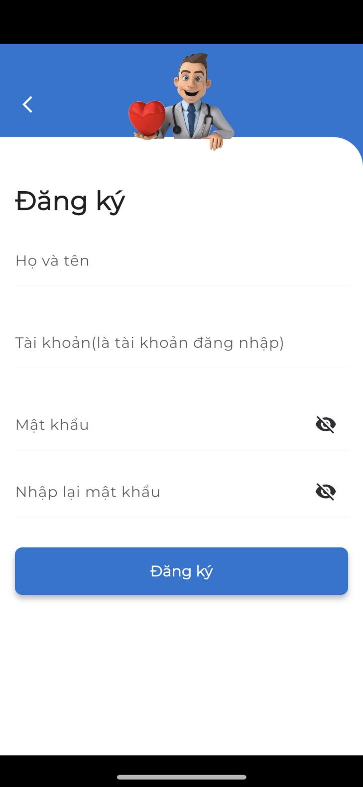
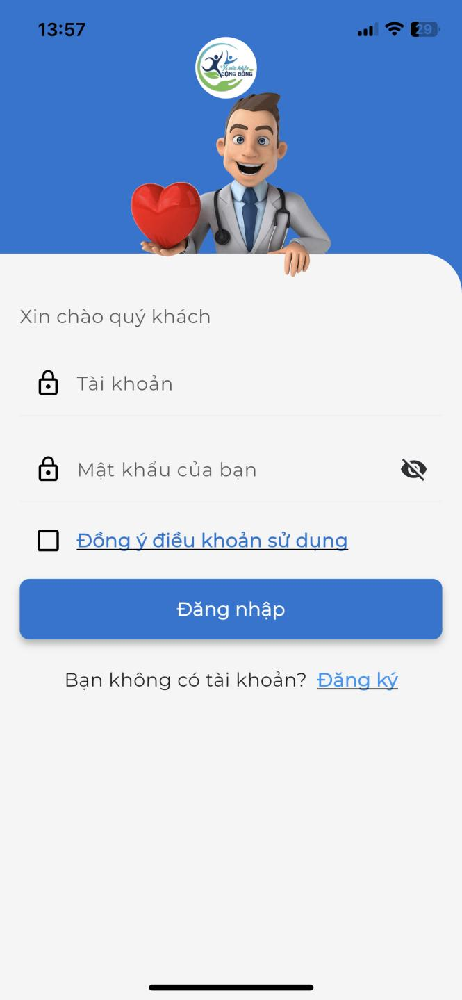
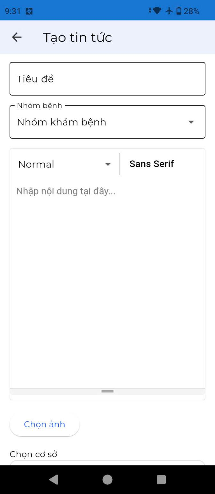

**CÔNG TY CỔ PHẦN GIẢI PHÁP CÔNG NGHỆ TECHBER VIỆT NAM**

{width="0.75in" height="0.75in"}**\**

**HƯỚNG DẪN SỬ DỤNG**

**APP HÙNG VƯƠNG MEDICAL**

MỤC LỤC

# Table of Contents {#table-of-contents .TOC-Heading}

[1. Tải và cài đặt ứng dụng
[3](#tải-và-cài-đặt-ứng-dụng)](#tải-và-cài-đặt-ứng-dụng)

[2. Đăng ký tài khoản [3](#đăng-ký-tài-khoản)](#đăng-ký-tài-khoản)

[3. Đăng nhập [4](#đăng-nhập)](#đăng-nhập)

[4. Đợt khám bệnh [5](#đợt-khám-bệnh)](#đợt-khám-bệnh)

[5. Xét nghiệm [8](#xét-nghiệm)](#xét-nghiệm)

[6. Thuốc [10](#thuốc)](#thuốc)

[7. Lịch tái khám [12](#lịch-tái-khám)](#lịch-tái-khám)

[8. Hộ gia đình [13](#hộ-gia-đình)](#hộ-gia-đình)

[9. Báo cáo thống kê [15](#báo-cáo-thống-kê)](#báo-cáo-thống-kê)

[10. Tin tức [16](#tin-tức)](#tin-tức)

[11. Đặt câu hỏi [19](#đặt-câu-hỏi)](#đặt-câu-hỏi)

# Tải và cài đặt ứng dụng

> Để tải ứng dụng, người dùng truy cập vào CHPlay (trên điện thoại
> Android) và tìm kiếm theo từ khóa "**Hùng Vương Care**"
>
> hoặc Appstore (trên điện thoại IPhone) và tìm kiếm theo từ khóa
> "**Hùng Vương Medical**".
>
> Người dùng tải app và tiến hành cài đặt app như thông thường.
>
> Khi mở ứng dụng, hệ thống sẽ yêu cầu gửi thông báo, nhấn Chấp nhận để
> nhận các thông báo mới nhất từ ứng dụng.

# Đăng ký tài khoản

> Người dùng khi chưa có tài khoản, nhấn vào mục [Đăng ký tài
> khoản]{.underline} trên màn hình ứng dụng sau đó thực hiện theo các
> bước:
>
> Bước 1: Nhập các thông tin theo form đăng ký gồm: Họ và tên, Giới
> tính, Ngày sinh, Địa chỉ, Số điện thoại
>
> Bước 2: Nhập tài khoản là số CCCD
>
> Bước 3: Nhập mật khẩu và Nhập lại mật khẩu
>
> Bước 4: Nhấn **Đăng ký tài khoản** để hoàn thành đăng ký.
>
> {width="3.3118055555555554in"
> height="7.16875in"}
>
> Sau khi đăng ký tài khoản thành công, người dùng sử dụng tài khoản đã
> đăng ký để truy cập vào ứng dụng.

# Đăng nhập

> Để đăng nhập vào hệ thống, người dùng thực hiện theo các bước:
>
> Bước 1: Nhập tài khoản
>
> Bước 2: Nhập mật khẩu
>
> Bước 3: Nhấn **Đăng nhập** để truy cập vào ứng dụng
>
> {width="3.022222222222222in"
> height="4.674305555555556in"}

# Đợt khám bệnh

> **Tạo đợt khám**
>
> Bệnh nhân khi đi khám tự tạo đợt khám bệnh hoặc nhân viên Điều dưỡng,
> Y tá có thể hỗ trợ tạo đợt khám bệnh.
>
> Bước 1: Nhấn vào menu chức năng Khám bệnh {width="0.9583333333333334in"
> height="0.6805555555555556in"}
>
> Bước 2: Nhấn nút **Thêm mới** để tạo đợt khám mới
>
> {width="3.4558267716535434in"
> height="1.5697648731408573in"}
>
> Bước 3: Nhập các thông tin của đợt khám: Chọn nhóm bệnh, Chọn bệnh
> chẩn đoán, ngày khám ...
>
> {width="2.7916666666666665in"
> height="6.397222222222222in"}
>
> Bước 4: Nhấn biểu tượng lưu ở góc phải màn hình để lưu thông tin
>
> **Cập nhật thông tin đợt khám**
>
> Bệnh nhân có thể xem lại danh sách đợt khám của mình. Khi đã có kết
> quả khám bệnh, bệnh nhân hoặc Điều dưỡng phòng khám sẽ vào đợt khám và
> cập nhật thông tin cho bệnh nhân:
>
> Bước 1: Nhấn icon chỉnh sửa đợt khám
> {width="0.2916666666666667in"
> height="0.3194444444444444in"}
>
> Bước 2: Nhập các thông tin như Hẹn tái khám, Mô tả tái khám, Kết quả
> chẩn đoán, Ghi chú đơn thuốc (nếu có)
>
> Bước 3: Nhấn icon Save để lưu thông tin
>
> Để chụp ảnh đơn thuốc {width="0.375in"
> height="0.3333333333333333in"}, người dùng nhấn vào icon máy ảnh của
> đợt khám để thực hiện chụp ảnh. Hình ảnh đơn thuốc sẽ hiển thị trong
> trang thông tin đợt khám.
>
> **Xem thông tin đợt khám**
>
> Người dùng nhấn tên Mã đợt khám để xem toàn bộ thông tin đợt khám. Tại
> màn hình này sẽ bao gồm:

- Thông tin người bệnh

- Kết luận của bác sĩ

- Đơn thuốc

- Các kết quả xét nghiệm liên quan

{width="2.5097222222222224in"
height="5.752083333333333in"}

# Xét nghiệm

> Điều dưỡng phòng khám truy cập vào menu Xét nghiệm {width="1.0138888888888888in"
> height="0.7222222222222222in"}, và thực hiện thêm kết quả xét nghiệm
> vào cho bệnh nhân:
>
> Bước 1: Chọn dịch vụ xét nghiệm
>
> Bước 2: Chọn đợt khám của bệnh nhân
>
> {width="2.9443055555555557in"
> height="2.3613724846894137in"}
>
> Bước 3: Nhấn nút **Tạo kết quả xét nghiệm**. Màn hình sẽ hiển thị các
> chỉ số xét nghiệm tương ứng.
>
> Bước 4: Điều dưỡng nhập kết quả
>
> {width="2.5833333333333335in"
> height="5.920138888888889in"}
>
> Bước 5: Nhấn nút **Lưu kết quả**
>
> Sau khi lưu thành công, kết quả xét nghiệm sẽ được liên kết với đợt
> khám của bệnh nhân.

# Thuốc

> Ứng dụng quản lý thông tin thuốc theo đợt khám.
>
> Điều dưỡng truy cập vào đợt khám của bệnh nhân, thêm các thông tin
> thuốc cần thiết:
>
> Bước 1: Chọn đợt khám cần lưu thông tin thuốc
>
> Bước 2: Nhấn nút Thêm ảnh
>
> {width="3.75in" height="2.275in"}
>
> Bước 3: Chọn ảnh từ thư viện hoặc chụp ảnh đơn thuốc
>
> Bước 4: Nhập ghi chú thuốc
>
> {width="3.6974070428696413in"
> height="3.524861111111111in"}
>
> Bước 5: Nhấn nút **Lưu** để hoàn thành
>
> Để xem lại thông tin đơn thuốc, nhấn vào nút **Xem chi tiết** trên đợt
> khám.
>
> {width="2.75in"
> height="6.302083333333333in"}

# Lịch tái khám

> Truy cập menu Lịch tái khám để xem thông tin lịch tái khám.
>
> Bệnh nhân chọn đợt khám và nhấn nút **Chi tiết** để xem thông tin lịch
> tái khám.
>
> {width="2.7736111111111112in"
> height="6.357638888888889in"}

# Hộ gia đình

> Hộ gia đình là tính năng cho phép theo dõi thông tin khám bệnh của các
> thành viên khác trong gia đình mà đã đăng ký tài khoản khám bệnh tại
> phòng khám.
>
> Người dùng truy cập vào menu hộ gia đình và thực hiện thêm hộ gia
> đình:
>
> Bước 1: Nhấn nút **Thêm hộ gia đình**
>
> {width="2.6069444444444443in"
> height="1.7118055555555556in"}
>
> Bước 2: Nhập tên gia đình và mô tả
>
> {width="3.1804669728783903in"
> height="2.7443493000874892in"}
>
> Bước 3: Nhấn **Lưu** để hoàn thành tạo hộ gia đình
>
> Tại màn hình chính hộ gia đình, có thể theo dõi hộ gia đình của mình,
> và hộ gia đình mà mình đang tham gia.
>
> Để thêm người thân vào hộ gia đình, người dùng thực hiện:
>
> Bước 1: Nhấn nút **Thêm người thân**
>
> Bước 2: Nhập chính xác số tài khoản CCCD của người than
>
> Bước 3: Chọn hộ gia đình để thêm vào.
>
> {width="3.1096052055993in"
> height="2.644712379702537in"}
>
> Bước 4: Nhấn **Lưu** để hoàn thành
>
> Sau khi hoàn thành thêm người thân, người thân sẽ nhận được thông báo
> trên ứng dụng. Người than cần xác nhận mới có thể thêm vào hộ gia
> đình:
>
> Bước 1: Truy cập vào mục thông báo trên ứng dụng
>
> Bước 2: Nhấn vào thông báo
>
> Bước 3: Nhấn nút **Xác nhận** để tham gia vào hộ gia đình.

# Báo cáo thống kê

> Người dùng có thể theo dõi báo cáo của các chỉ số xét nghiệm theo các
> đợt khám của mình.
>
> Bước 1: Truy cập menu Thống kê báo cáo
>
> Bước 2: Chọn dịch vụ xét nghiệm
>
> Bước 3: Chọn chỉ số cần theo dõi
>
> Bước 4: Chọn số lượng đợt khám muốn theo dõi
>
> Bước 5: Nhấn nút **Xem thống kê**, ứng dụng sẽ hiển thị biểu đồ báo
> cáo chỉ số xét nghiệm tương ứng.
>
> {width="2.3854166666666665in"
> height="5.466666666666667in"}

# Tin tức

> Người bệnh có thể xem các tin tức liên quan đến nhóm bệnh của mình tại
> trang chủ. Nhấn vào 1 tin tức để đọc chi tiết tin tức.
>
> Với điều dưỡng, bác sỹ khi muốn đăng tin thực hiện theo các bước sau:
>
> Bước 1: Chọn menu Tin tức ở bottom bar hoặc nhấn nút Xem tất cả
>
> Bước 2: Nhấn vào nút dấu + để thêm tin tức
>
> {width="3.19375in"
> height="7.319444444444445in"}
>
> Bước 3: Nhập tiêu đề
>
> {width="3.0541666666666667in"
> height="7.0in"}
>
> Bước 4: Chọn nhóm bệnh
>
> Bước 5: Nhập nội dung tin tức
>
> Bước 6: Upload lên ảnh đính kèm nếu có
>
> Bước 7: Chọn cơ sở đăng tin
>
> Bước 8: Chọn kích hoạt để hiển thị tin tức cho người đọc
>
> Bước 9: Nhấn **Lưu** để hoàn thành

# Đặt câu hỏi

> Người dùng có thể đọc các câu hỏi và câu trả lời của bác sĩ hiển thị
> tại trang chủ.
>
> Để thêm câu hỏi, người dùng nhấn vào nút dấu {width="0.7222222222222222in"
> height="0.7222222222222222in"}, ứng dụng hiển thị danh sách câu hỏi
> dạng list.
>
> Để thêm câu hỏi:
>
> Bước 1: Nhấn icon dấu +
>
> {width="2.745833333333333in"
> height="6.29375in"}
>
> Bước 2: Chọn khoa: Thuốc/ Bệnh/ Tư vấn
>
> Bước 3: Nhập nội dung câu hỏi
>
> {width="3.364825021872266in"
> height="4.679558180227471in"}
>
> Bước 4: Nhấn nút **Gửi câu hỏi**
>
> Khi câu hỏi được bác sỹ trả lời, bệnh nhân có thể đọc thông tin trên
> ứng dụng.
>
> Với bác sỹ, để trả lời câu hỏi của bệnh nhân: bác sỹ xem các câu hỏi
> chưa được trả lời và nhấn nút: **Trả lời câu hỏi**. Sau đó, bác sỹ
> nhập câu trả lời và nhấn **Gửi** để hoàn thành.
>
> {width="3.0930555555555554in"
> height="7.088888888888889in"}
